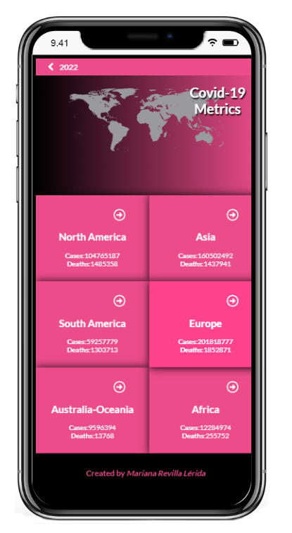
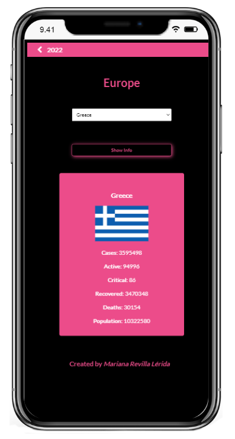

# React - Metrics Webapp

> I used an API that provides numeric data about a Covid-19 around the world. The webapp have two pages:

> - Home page: Display a list of items that have been filtered by some continents.

  

> - Details page: Display data about a country that you choose in this continent.

  

## Built With

- JavaScript
- React - Redux

## Live Demo

[Live Demo](https://webapp-covid19-metrics.netlify.app/)

  

## Getting Started

To get a local copy up and running follow these simple example steps.

n the project directory, you can clone the repository with the following link: `https://github.com/marurevi/React---Metrics-webapp`

Once you have clone the repository run: npm install to install all the dependencies that you need. Then you can run a live version with the command npm start.

## Authors

👤 **Mariana Revilla Lérida**

- GitHub: [@marurevi](https://github.com/marurevi)
- Twitter: [@MaruRevilla](https://twitter.com/MaruRevilla)
- LinkedIn: [Mariana-Revilla-Lérida](https://linkedin.com/in/mariana-revilla-l%C3%A9rida-a12aba143)

## 🤝 Contributing

Contributions, issues, and feature requests are welcome!

Feel free to check the [issues page](../../issues/).

## Show your support

Give a ⭐️ if you like this project!

## Acknowledgments

- Original design idea by [Nelson Sakwa on Behance](https://www.behance.net/sakwadesignstudio).

- [Creative Commons license of the design](https://creativecommons.org/licenses/by-nc/4.0/) 

## 📝 License

This project is [MIT](./LICENCE) licensed.
